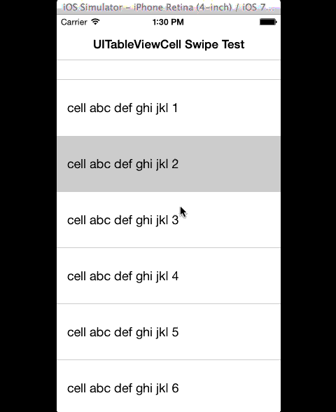

CellSwipe
=========

Swipe left to reveal UIButtons under a UITableViewCell

Works in iOS6 and iOS7. Only supports swiping left (although support for swiping right should be trivial).

All UI controls are added programmatically, i.e. no use of the .xib.

Here's how it works:

# A new UIView is created and inserted below each UITableViewCell.
# UIButtons are added as subviews to this UIView, setting the target/action within each UITableViewCell.
# A UIPanGestureRecognizer is added to each UITableViewCell and uses the recognizer's delegate methods to slide the x origin of the cell's frame as the user pans left, thereby revealing the UIButtons underneath.
# If the user taps on a UIButton, the targetted action will pass the event along to the cell's delegate (usually, the UITableViewController), and then slide the UITableViewCell back to its original position.
# If the user swipes on the same UITableViewCell that is currently showing UIButtons, that cell will slide back.
# If the user swipes on a different UITableViewCell while another cell is showing UIButtons, that other cell will slide back.
# If the user scrolls the UITableView while a UITableViewCell is showing UIButtons, that cell will slide back.
# If the user highlights any UITableViewCell while any UITableViewCell is showing UIButtons, that cell will slide back.

Update, Jan. 22, 2014:
- Added elastic effect when swiping cell to better match native iOS apps (e.g. Mail app).
